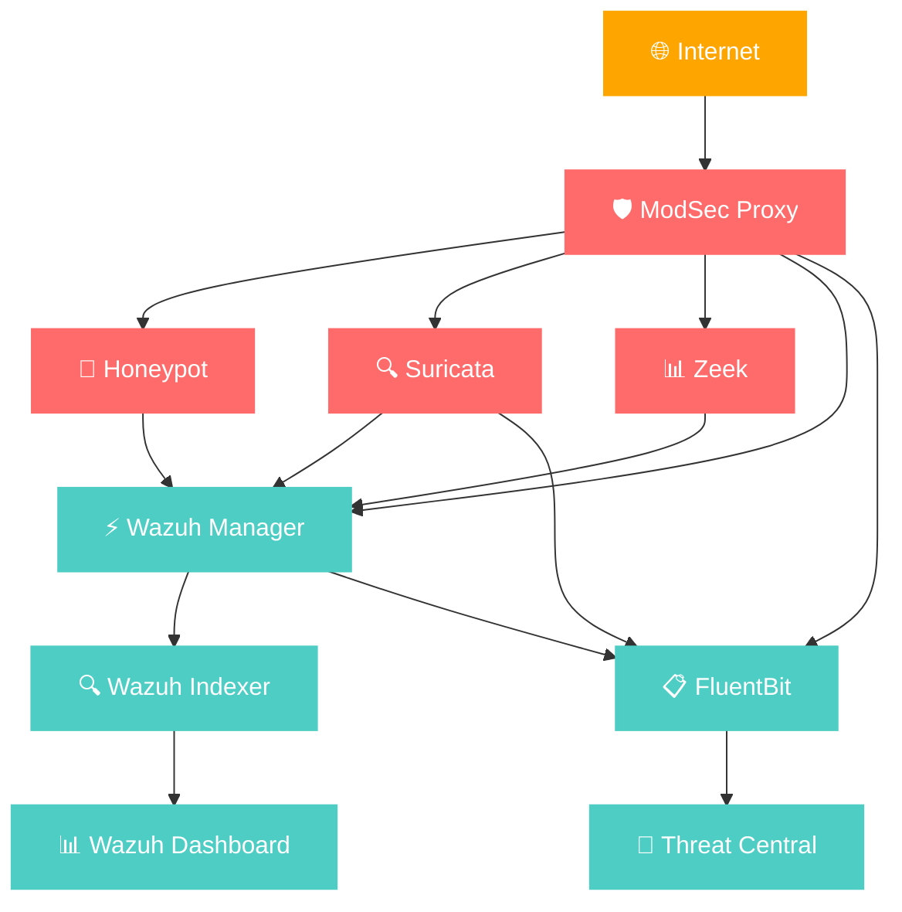

# 🛡️ Security Monitoring Stack
## Comprehensive Honeypot & SIEM Architecture

---

## 🎯 Objective
Design and implement a proof-of-concept honeypot ecosystem, containerized with Docker, that integrates IDS and SIEM tools to capture, organize, and generate alerts for potential security threats.  

---

## 📊 Traffic Flow

```
🌐 Internet Traffic → 🔒 ModSec Proxy → 🍯 Honeypot → 📈 SIEM Analysis
```

---

## 🌐 Network Architecture

### 🍯 HoneyNet
> **Purpose:** Attack detection and analysis network

| Service | Description | Ports | Key Features |
|---------|-------------|-------|--------------|
| **🍯 Honeypot (Go)** | Main honeypot service with Wazuh agent integration | - | Privileged mode, SIEM connectivity |
| **🛡️ ModSec Proxy** | NGINX + ModSecurity Web Application Firewall | `80:80`, `443:443`, `990:990` | OWASP CRS, SSL/TLS |
| **🔍 Suricata IDS** | Network intrusion detection system | - | AF-PACKET, Auto-FP, Custom rules |
| **📊 Zeek Network Monitor** | Network security monitoring & analysis | - | Custom logging, Protocol analysis |

### 🔧 SIEM Network
> **Purpose:** Security information and event management

| Service | Description | Ports | Key Features |
|---------|-------------|-------|--------------|
| **⚡ Wazuh Manager** | Central SIEM management & correlation engine | `1514:1514`, `1515:1515`, `514:514/udp`, `55000:55000` | All security tools logging |
| **🔍 Wazuh Indexer** | OpenSearch-based data indexing & storage | `9200:9200` | SSL/TLS, Authentication |
| **📊 Wazuh Dashboard** | Web-based security analytics dashboard | `5601:5601` | Real-time monitoring, Alerting |
| **🚀 Threat Central** | Custom threat intelligence service | - | Threat analysis & correlation |
| **📋 FluentBit** | Log processor & forwarder | - | ModSec, Suricata, Wazuh logs |

---

## 🔄 Service Dependencies


```mermaid
graph TD
    A[🌐 Internet] --> B[🛡️ ModSec Proxy]
    B --> C[🍯 Honeypot]
    B --> D[🔍 Suricata]
    B --> E[📊 Zeek]
    
    C --> F[⚡ Wazuh Manager]
    D --> F
    E --> F
    B --> F
    
    F --> G[🔍 Wazuh Indexer]
    G --> H[📊 Wazuh Dashboard]

    D --> I[📋 FluentBit]
    B --> I
    F --> I

    I[📋 FluentBit] --> J[🚀 Threat Central]
    
    classDef honeynet fill:#ff6b6b,stroke:#ff6b6b,stroke-width:2px,color:#fff
    classDef siemnet fill:#4ecdc4,stroke:#4ecdc4,stroke-width:2px,color:#fff
    classDef external fill:#ffa500,stroke:#ffa500,stroke-width:2px,color:#fff
    
    class B,C,D,E honeynet
    class F,G,H,I,J siemnet
    class A external
```

---

## 📈 Stack Statistics

| Metric | Count | Description |
|--------|-------|-------------|
| **🔧 Services** | 10 | Total containerized services |
| **🌐 Networks** | 2 | Isolated network segments |
| **🚪 Exposed Ports** | 7 | External access points |
| **💾 Volumes** | 15 | Persistent data storage |

---

## 🤔 Why Wazuh?

Wazuh was chosen as the core SIEM for this stack because it offers several unique advantages:

🖥️ Agent-Based Monitoring
Wazuh provides lightweight agents that run directly on endpoints and containers. These agents collect logs, monitor processes, file integrity, and system activity, giving deep visibility into what’s happening inside the honeypot.

📋 Strong Baseline Detection
In a tightly controlled and fully patched environment, Wazuh can detect deviations from the expected baseline. If a compromise occurs despite all services being up to date, this strongly suggests exploitation of an unknown (0day) vulnerability.

⚡ Real-Time Correlation
The Wazuh Manager correlates data from multiple sources (honeypot logs, IDS alerts, network monitors, and system telemetry) to identify complex attack patterns that individual tools may miss.

🌍 Threat Intelligence Integration
Wazuh supports integration with external threat feeds, allowing correlation between live attacks and known malicious indicators — and extending with custom services like Threat Central in this project.

🔐 Security Ecosystem Compatibility

Built-in support for Suricata, Zeek, and ModSecurity logs

SSL/TLS support for secure communication

Strong API and dashboard for visualization

📊 Open & Extensible
As an open-source SIEM, Wazuh allows full customization of rules, decoders, and alerts, making it ideal for a research-oriented honeypot ecosystem.

---

## 🏗️ Architecture Overview

### Security Layers

1. **🌐 Entry Point**
   - ModSecurity WAF with OWASP Core Rule Set
   - SSL/TLS termination
   - Traffic analysis and logging

2. **🍯 Detection Layer**
   - Go-based honeypot for attack simulation
   - Suricata IDS for network intrusion detection
   - Zeek for deep packet inspection and analysis

3. **📊 Analysis Layer**
   - Wazuh SIEM for event correlation
   - Custom threat intelligence integration
   - Real-time alerting and response

4. **💾 Storage Layer**
   - OpenSearch-based indexing
   - Persistent log storage
   - Historical analysis capabilities

### Network Segmentation

#### HoneyNet (`honeynet`)
- **Purpose:** Isolated environment for attack detection
- **Services:** Honeypot, ModSec Proxy, Suricata, Zeek
- **Security:** DMZ-like setup with controlled external access

#### SIEM Network (`siemnet`)
- **Purpose:** Security management and analysis
- **Services:** Wazuh stack, Threat Central, FluentBit
- **Security:** Internal network with authenticated access

---

## 🔐 Security Features

### 🛡️ Protection Mechanisms
- **Web Application Firewall** - ModSecurity with OWASP CRS
- **Network IDS** - Suricata with custom rules
- **Deep Packet Inspection** - Zeek network analysis
- **SSL/TLS Encryption** - Certificate-based security
- **Access Control** - Network segmentation and authentication

### 📋 Monitoring Capabilities
- **Real-time Alerts** - Immediate threat notification
- **Log Aggregation** - Centralized logging via FluentBit
- **Event Correlation** - Wazuh rule-based analysis
- **Threat Intelligence** - Custom threat data integration
- **Historical Analysis** - Long-term trend analysis

### 🔄 Data Flow
1. External traffic hits ModSec Proxy
2. Decrypted traffic reaches honeypot services
3. All interactions logged by monitoring tools
4. Logs processed and forwarded to Wazuh
5. Events correlated and alerts generated
6. Data indexed for analysis and reporting

---

## 📝 Configuration Files

| Component | Configuration |
|-----------|---------------|
| **ModSecurity** | `./modsecurity/modsecurity.conf` |
| **Suricata** | `./suricata/suricata.yaml` |
| **Zeek** | `./zeek/site/custom-logging.zeek` |
| **Wazuh** | `./config/wazuh_cluster/wazuh_manager.conf` |
| **FluentBit** | `./fluent-bit/fluent-bit.conf` |

---

# 🚀 Quick Start Guide

## Prerequisites

- Docker and Docker Compose installed
- Linux host (for max_map_count setting)
- Root/sudo access for system configuration

## 1. System Configuration

### Linux Host Setup
Increase the maximum number of memory map areas (required for Wazuh Indexer):

```bash
sudo sysctl -w vm.max_map_count=262144
```

To make this permanent, add to `/etc/sysctl.conf`:
```bash
echo 'vm.max_map_count=262144' | sudo tee -a /etc/sysctl.conf
```

## 2. Certificate Generation

### Generate Wazuh Certificates
Run the Wazuh certificate generation script:

```bash
docker-compose -f generate-indexer-certs.yml run --rm generator
```

This will create SSL certificates in `./config/wazuh_indexer_ssl_certs/` for:
- Wazuh Indexer
- Wazuh Manager  
- Wazuh Dashboard
- Root CA certificates

### Generate ModSecurity SSL Certificates
Create self-signed certificates for the ModSecurity proxy:

```bash
# Create certificate directory if it doesn't exist
mkdir -p modsec-proxy

# Generate private key
openssl genrsa -out modsec-proxy/key.pem 2048

# Generate certificate signing request
openssl req -new -key modsec-proxy/key.pem -out modsec-proxy/cert.csr -subj "/C=US/ST=State/L=City/O=Organization/CN=localhost"

# Generate self-signed certificate
openssl x509 -req -days 365 -in modsec-proxy/cert.csr -signkey modsec-proxy/key.pem -out modsec-proxy/cert.pem

# Clean up CSR file
rm modsec-proxy/cert.csr
```

## 3. Start the Environment

### Start All Services
Launch the complete honeypot and SIEM stack:

```bash
# Start in background (recommended)
docker-compose up -d

# Or start in foreground to see logs
docker-compose up
```

### Verify Services
Check that all containers are running:

```bash
docker-compose ps
```

## 4. Access Points

Once all services are running, you can access:

| Service | URL | Credentials |
|---------|-----|-------------|
| **Wazuh Dashboard** | https://localhost:5601 | `admin` / `SecretPassword` |
| **Wazuh API** | https://localhost:55000 | `wazuh-wui` / `MyS3cr37P450r.*-` |
| **Honeypot (HTTPS through nginx proxy)** | https://localhost:443 | - |
| **FTP (TLS through nginx proxy)** | ftp://localhost:990 | - |

## 5. First Steps

1. **Access Wazuh Dashboard**: Navigate to https://localhost:5601
2. **Login**: Use `admin` / `SecretPassword`
3. **Check Agent Status**: Go to "Agents" to verify the honeypot agent is connected
4. **View Logs**: Check "Logs" section for real-time security events
5. **Test Honeypot**: Send requests to http://localhost:80 or https://localhost:443

## 6. Monitoring

### View Logs
```bash
# View all service logs
docker-compose logs -f

# View specific service logs
docker-compose logs -f wazuh.manager
docker-compose logs -f modsec-proxy
docker-compose logs -f honeypot
```

### Threat-Central
```bash
sudo docker compose exec threat-central ./threat-central
```

### Check Service Health
```bash
# Check container status
docker-compose ps

# Check resource usage
docker stats
```

## 7. Troubleshooting

### Common Issues

**Wazuh Indexer won't start:**
- Ensure `vm.max_map_count=262144` is set
- Check available disk space (requires ~2GB)

**Certificate errors:**
- Verify certificates were generated in correct directories
- Check file permissions on certificate files

**Network connectivity issues:**
- Ensure ports 80, 443, 5601, 55000 are not in use
- Check Docker network configuration

### Reset Environment
```bash
# Stop all services
docker-compose down

# Remove volumes (WARNING: This deletes all data)
docker-compose down -v

# Rebuild and restart
docker-compose up --build -d
```

## 8. Next Steps

- Configure custom ModSecurity rules in `./modsecurity/`
- Add custom Suricata rules in `./suricata/rules/`
- Customize Zeek scripts in `./zeek/site/`
- Set up custom Wazuh rules in `./wazuh-manager/ruleset/`

---

*This architecture provides comprehensive security monitoring with honeypot capabilities, network intrusion detection, and centralized SIEM analysis.*
